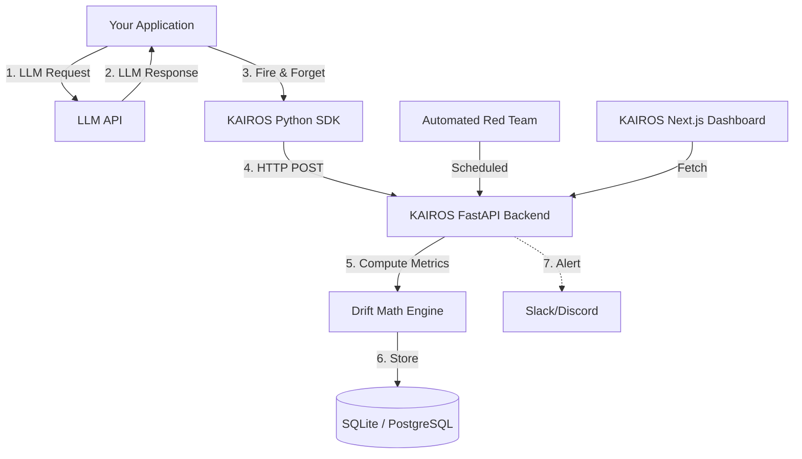

# KAIROS 👁️
**Catch the moment your AI starts to break — before your users do.**


KAIROS is a production-grade AI observability and behavioral monitoring system. It sits alongside any LLM application (OpenAI, Anthropic, Gemini, local models) to build a mathematical baseline of its "healthy" behavior, and then continuously monitors for semantic drift, hallucination spikes, sycophancy, and refusal loops.

---

## 🚀 Why KAIROS?

LLMs degrade silently. A new safety filter from an API provider, a subtle shift in user prompt distributions, or a bad RAG retrieval update can cause your model to suddenly become excessively verbose, start refusing benign prompts, or drop into a sycophantic loop. 

Traditional APM tools monitor latency and error rates. **KAIROS monitors behavior.**

*   **Behavioral Fingerprinting:** Captures the multi-dimensional baseline of your healthy model.
*   **Continuous Drift Detection:** Uses Cosine Similarity, KL Divergence, and Z-Score math to catch deviations instantly.
*   **Automated Red Teaming:** Scheduled probe suites stress-test the model for hallucinations and sycophancy.
*   **AI-Native Diagnostics:** When drift occurs, KAIROS uses an LLM to read the math and generate a plain-English root cause analysis report.

---

## 🏗️ Architecture

KAIROS operates as an asynchronous sidecar to your main application, ensuring zero latency impact on your critical path.



---

## 💻 SDK Integration

Integrating KAIROS into your existing Python application takes 3 lines of code. The SDK uses background threads to ensure your app is never blocked.

```python
from kairos_sdk import KairosMonitor
import openai

# 1. Initialize the monitor
monitor = KairosMonitor(
    api_url="http://localhost:8000",
    app_name="customer_support_bot"
)

def generate_response(prompt: str) -> str:
    # Your normal LLM call
    response = openai.ChatCompletion.create(
        model="gpt-4",
        messages=[{"role": "user", "content": prompt}]
    )
    output = response.choices[0].message.content
    
    # 2. Log the interaction asynchronously
    monitor.log_interaction(
        prompt=prompt,
        response=output,
        metadata={"user_id": 123, "session_id": "abc"}
    )
    
    return output
```

---

## 📊 Dashboard Features

The KAIROS Next.js frontend is built with a sleek "Dark Cinematic" glassmorphism aesthetic, offering real-time insights into your fleet.

### 1. Behavioral Analysis
Track Cosine Similarity drift against the semantic centroid, verbosity distribution histograms, and KL Divergence for tone mapping.

### 2. Red Team Probe Suite
View automated vulnerability test results across categories: `Hallucination`, `Sycophancy`, `Consistency`, `Refusal Drift`, and `Factual Accuracy`.

### 3. Root Cause Reports
An event timeline of `ALERT` and `CRITICAL` drift anomalies, paired with AI-generated diagnostic reports explaining exactly *why* the math spiked and recommending remediation steps.

---

## 🛠️ Local Development

KAIROS is structured as a monorepo containing a Python FastAPI backend and a Next.js React frontend.

### Prerequisites
- Python 3.10+
- Node.js 18+

### Backend Setup
```bash
cd backend
python3 -m venv venv
source venv/bin/activate
pip install -r requirements.txt
uvicorn main:app --reload --port 8000
```

### Frontend Setup
```bash
cd frontend
npm install
npm run dev
```
Navigate to `http://localhost:3000` to view the dashboard.

---

## 📝 License
MIT License. Built by [Shaun Jerome](https://github.com/shaun6jrome).
